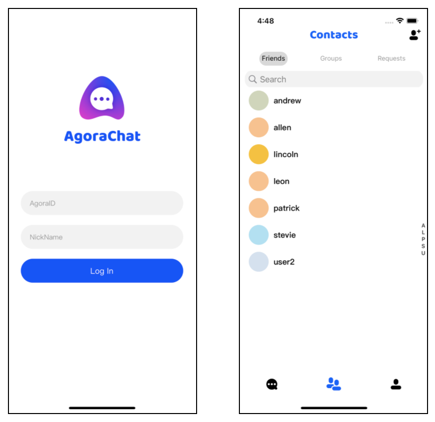

# Run the AgoraChat UIKit Demo

## Overview

The Agora Chat UIKit enables you to quickly embed real-time messaging in your app without extra efforts on the UI. This repository contains a sample project that uses the Agora Chat platform, the Agora Chat UIKit, and backend API to build and develip a mobile app with the following integrated chat features:

- Real-time one-to-one chat, group chat, and chatroom.
- Sending file, image, video, voice, and location messages.
- Push nitifications.



This page shows how to run the sample project.

## Prerequisites

Before proceeding, ensure that you have the following:

- Xcode 11.0 or later.
- CocoaPods. Refer to [Getting Started with CocoaPods](https://guides.cocoapods.org/using/getting-started.html#getting-started) if you have not installed CocoaPods.

## Run the sample project

Follow the steps to add the Agora Chat UIKit into your project and run the demo.

1. Clone this repositoty to your local machine.

   ```shell
   git clone git@github.com:AgoraIO-Usecase/AgoraChat-ios.git
   ```

2. Navigate to the root path of this project and run the following command to add UIKit into your project:

   ```shell
   pod install
   ```

3. Open the project with the following command:

   ```shell
   open AgoraChat.xcworkspace
   ```

4. Press `command + r` to run the project. And you can see the app launched on the simulator.

You are all set! Feel free to play with this sample project and explore features of the Agora Chat UIKit.

## Feedback

If you have any problems or suggestions regarding the sample projects, feel free to file an issue.

## Reference

Agora provides the full set of documentation and API Reference at [Agora Chat documents](https://docs-preprod.agora.io/en/test/agora_chat_overview?platform=Android).

## Related Resources

- Check our [FAQ](https://docs.agora.io/en/faq) to see if your issue has been recorded.
- Repositories managed by developer communities can be found at [Agora Community](https://github.com/AgoraIO-Community).
- If you encounter problems during integration, feel free to ask questions in [Stack Overflow](https://stackoverflow.com/questions/tagged/agora.io).

## License

Distributed under the MIT License. See `LICENSE` for more information.


